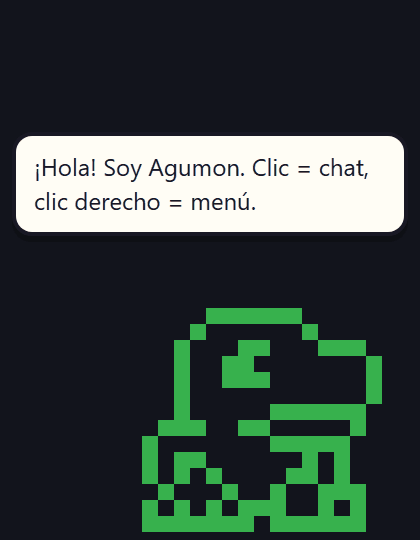

# digibuddy

[](LICENSE)


Mascota de escritorio para [tuipet](https://github.com/joeltco/tuipet): un
Digimon que pasea
por tu pantalla, habla contigo con IA local y observa tu partida — **sin
tocarla**.



Pasea por tu escritorio, le preguntas algo con un clic y responde con
Ollama en local (o con sus reglas si Ollama está apagado). Nunca escribe
tu save.

## Qué hace

- **Pasea** por el escritorio (clic para arrastrar, siempre visible).
- **Clic** → chat con IA local vía [Ollama](https://ollama.com)
  (`dolphin-phi` por defecto); si Ollama no responde, cae a reglas locales.
- **Clic derecho** → menú: Estado · Pomodoro (25/5) · Paseo · Recordatorio · Salir.
- **Lee tu save de tuipet** en vivo (watcher de 1 s): eclosiones,
  digivoluciones, victorias, hambre/suciedad… reacciona con animación y burbuja.

## Datos: solo lectura

digibuddy **nunca escribe** `save.json`. Espeja:

- `TUIPET_SAVE_DIR/save.json`, o
- `$XDG_DATA_HOME/tuipet/save.json`, o
- `~/.local/share/tuipet/save.json`

Tal como lo resuelve tuipet. La escritura la hace solo tuipet.

## Arrancar

```bash
pip install tuipet      # solo si aún no lo tienes
npm install
npm run tauri dev
```

Opcional, si ya no está en tuipet y quieres un save de prueba:

```bash
TUIPET_SAVE_DIR="ruta/a/save" npm run tauri dev   # PowerShell: $env:TUIPET_SAVE_DIR=...
```

Sprites del juego (si cambia tuipet o añades criaturas):

```bash
python tools/export_sprites.py    # → public/sprites.json
python tools/export_digidex.py    # → public/digidex.json (conocimiento)
```

`digidex.json` es la **conciencia** del bicho: qué es un Digimon, las 7
etapas, el triángulo de atributos, las 1.548 fichas del roster y las 51
líneas de digievolución de tuipet con la regla de cuidado de cada paso.
Se inyecta en el prompt del chat (`src/digipedia.ts`) y en la ficha del
bestiario; las preguntas sobre él mismo se responden localmente, sin
dejar que el modelo las invente.

IA: arranca Ollama (`ollama serve`) con `dolphin-phi` descargado
(`ollama pull dolphin-phi`). Modelo alternativo:

```js
// src/ai.ts
localStorage.setItem("digibuddy.model", "qwen2.5:7b");
```

Recordatorios desde el chat: `recordar regar plantas en 5 min`
(también `recuerda` / `recordame`, cantidades en palabras: `un`, `dos`…).

## Stack

Tauri 2 (Rust + TypeScript/Vite) · sprites 1-bit de tuipet renderizados en
canvas · Ollama por HTTP local desde Rust (sin CORS) · watcher de save en
`std::thread` con eventos al frontend.

## Aviso legal y créditos

Los sprites y la propiedad intelectual de Digimon son de **© Bandai**.
Proyecto fan, sin ánimo de lucro, para uso personal. No afiliado a Bandai.

Construido sobre [tuipet](https://github.com/joeltco/tuipet) — código de
Joel Taylor bajo licencia MIT (ver `LICENSE` y `NOTICE` de ese proyecto).
Los scripts de `tools/` importan el paquete `tuipet` para exportar sprites
y conocimiento.

Los archivos en `public/sounds/` y `public/sprites.json` derivan de
[DVPet](https://theundersigned.itch.io/dvpet) y de Digimon (© Bandai):
**no están cubiertos por la MIT** de este repo, que sólo cubre el código
fuente. Regenera ambos desde tu propia copia de tuipet con
`python tools/export_sprites.py` y `python tools/export_digidex.py`.
Detalles completos en `NOTICE`.
